### STEP 1 — Provision AWS Infrastructure with Terraform

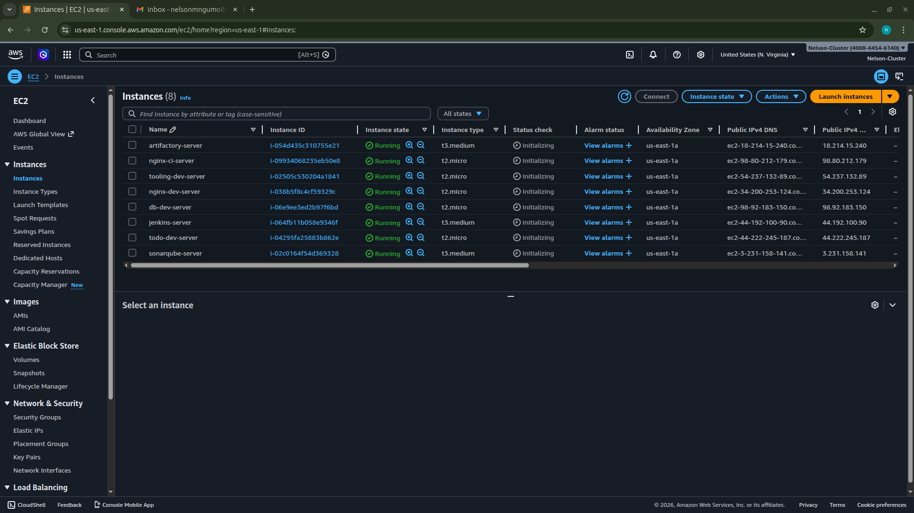
> All 8 EC2 instances in Running state after terraform apply

---

### STEP 2 — Install and Configure Jenkins

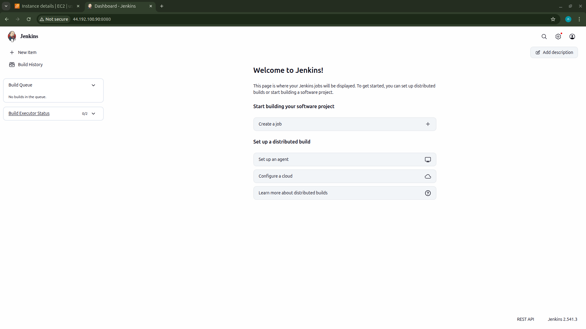
> Jenkins dashboard at 44.192.100.90:8080 — fresh installation confirmed

---

### STEP 3 — Install and Configure SonarQube

> php-todo project showing green Passed Quality Gate — last analysis March 21, 2026

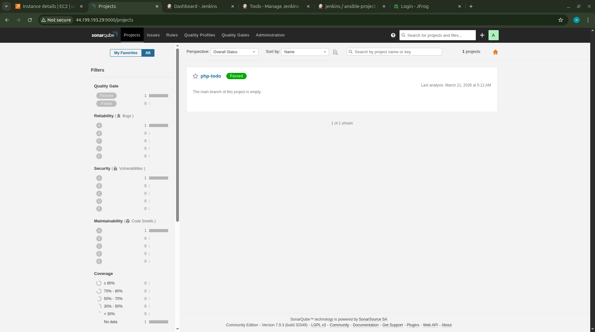
> First successful SonarQube scan after removing the JavaScript plugin

---

### STEP 4 — Install and Configure JFrog Artifactory

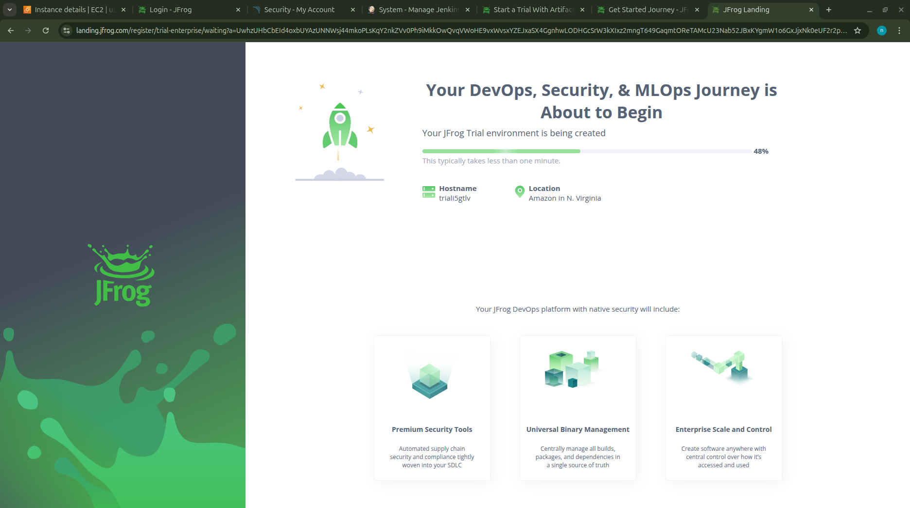
> JFrog Cloud trial environment being created — hostname triali5gtlv, AWS N. Virginia

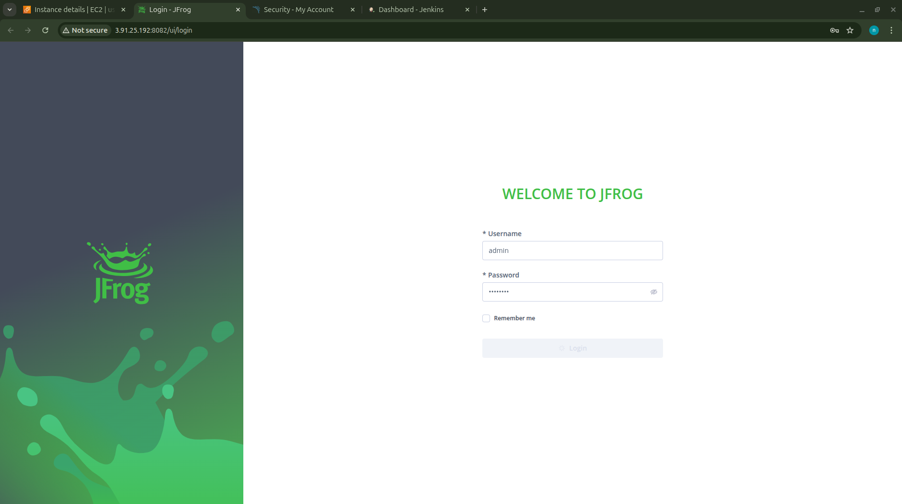
> On-premise JFrog Artifactory login at 3.91.25.192:8082

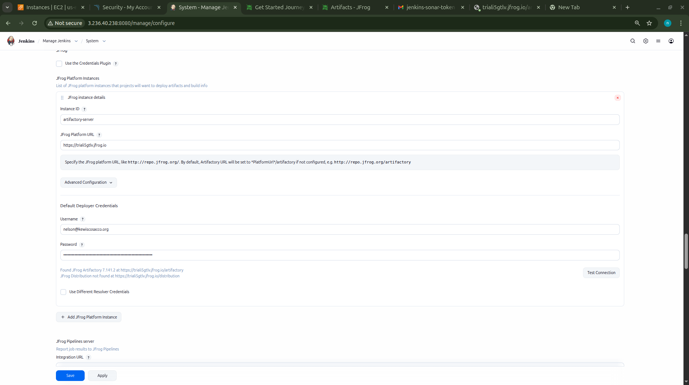
> Jenkins Configure System — JFrog instance configured, connection test shows "Found JFrog Artifactory 7.141.2"

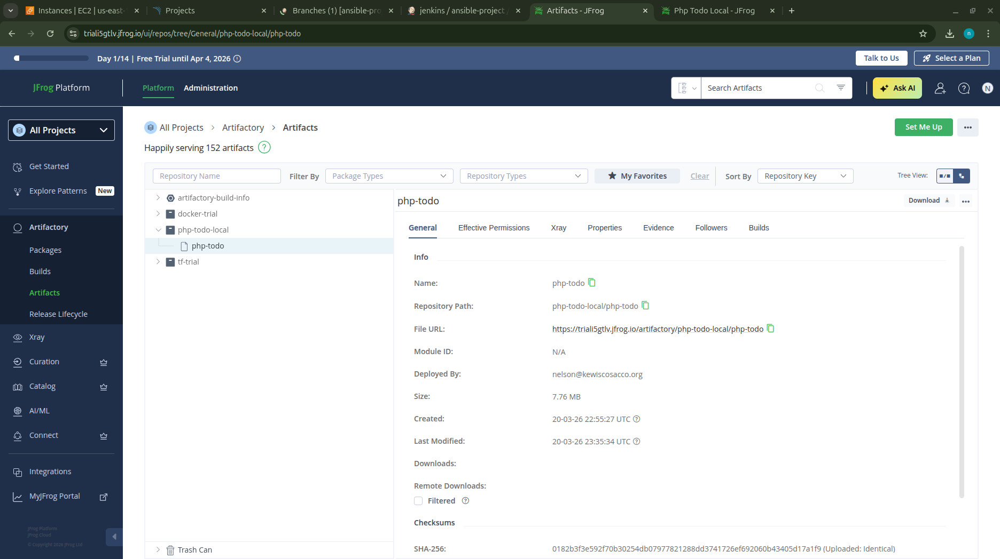
> php-todo artifact in Artifactory — 7.76 MB, deployed by nelson@kewiscosacco.org

> php-todo-local repository showing php-todo artifact with download link

---

### STEP 5 — Create php-todo Pipeline in Jenkins

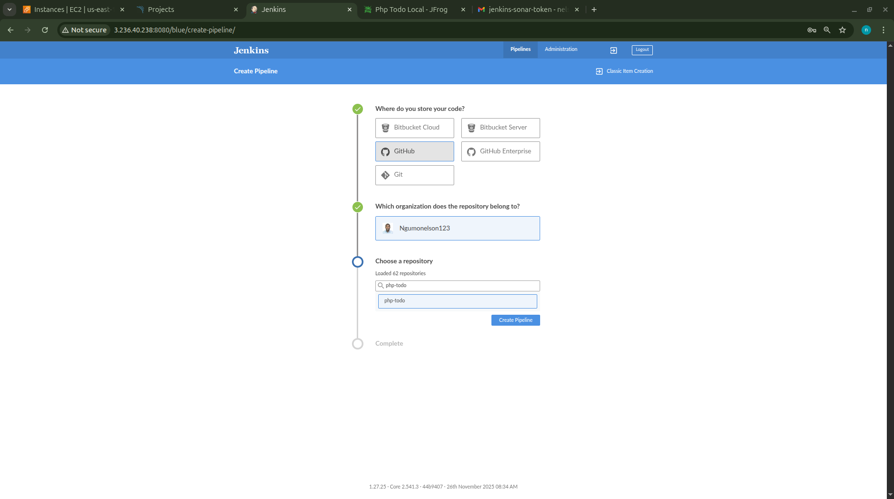
> Blue Ocean Create Pipeline — GitHub selected, connecting with access token

> Blue Ocean Create Pipeline — organization Ngumonelson123 confirmed, php-todo repo selected

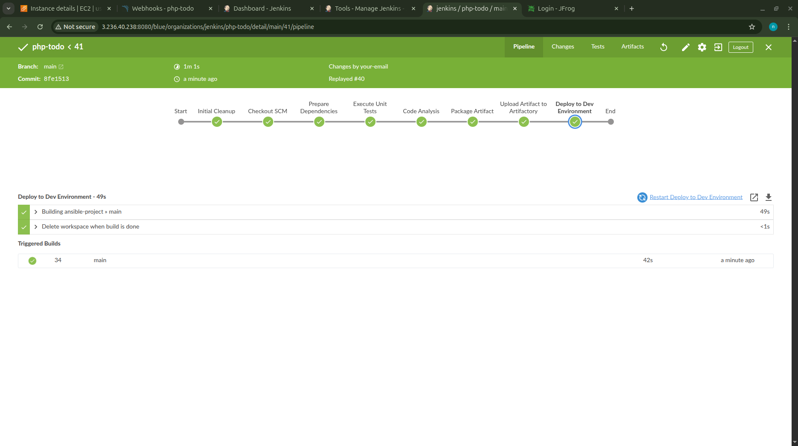
> php-todo build #41 — ALL stages green: Prepare Dependencies, Execute Unit Tests,
> Code Analysis, Package Artifact, Upload Artifact to Artifactory, Deploy to Dev
> Duration: 1m 1s. Triggered ansible-project build #34

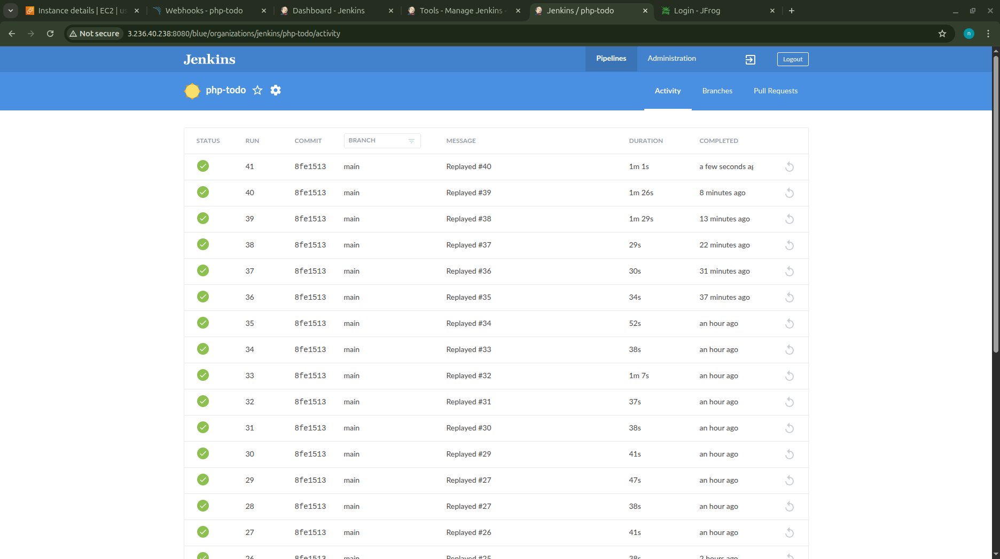
> php-todo activity page — builds #27 through #41 all green (consistent successful runs)

---

### STEP 6 — ansible-project Pipeline (SonarQube + Ansible Deploy)

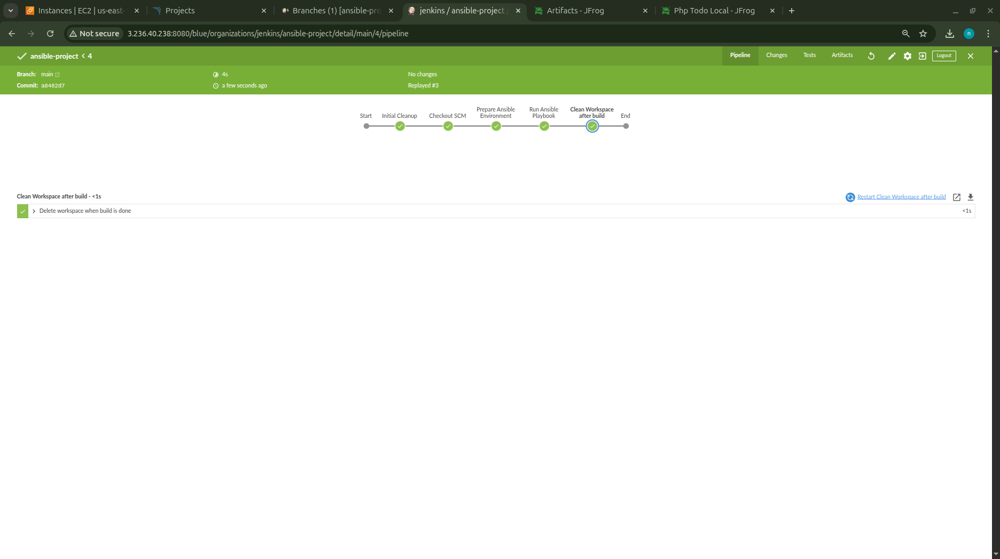
> ansible-project build #34 — ALL stages green: SonarQube Analysis, Quality Gate,
> Run Ansible Playbook. Duration: 42s. Started by upstream pipeline php-todo/main #41.
> Post step: "Pipeline completed successfully!"

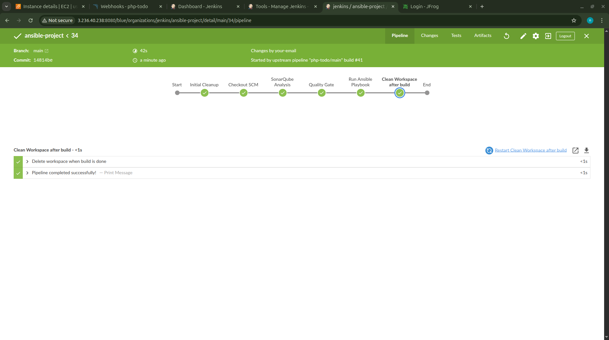
> ansible-project build #4 — early working version with stages:
> Prepare Ansible Environment, Run Ansible Playbook, Clean Workspace

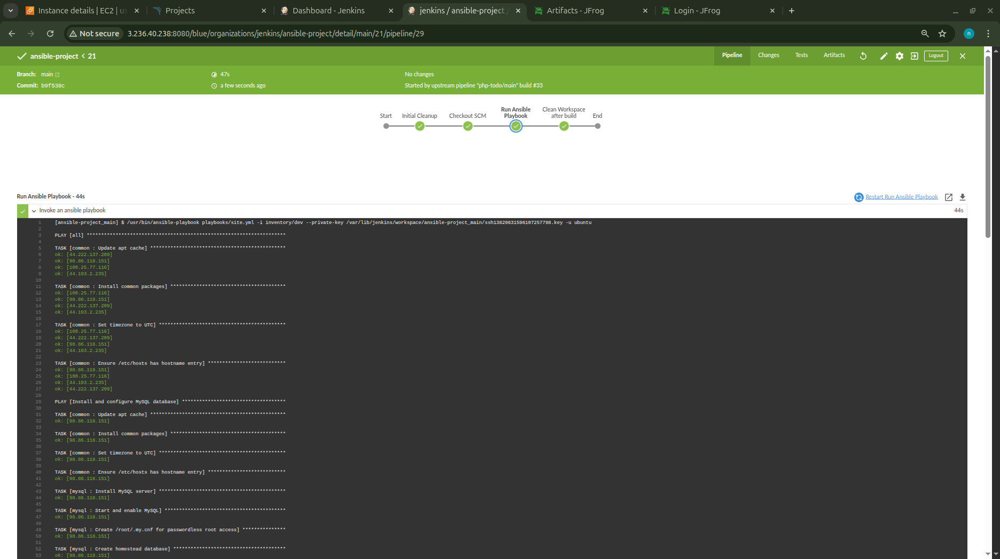
> Ansible playbook output — common role running across all dev servers,
> MySQL role installing and configuring database on db-dev-server

---

### STEP 7 — Ansible Roles Structure

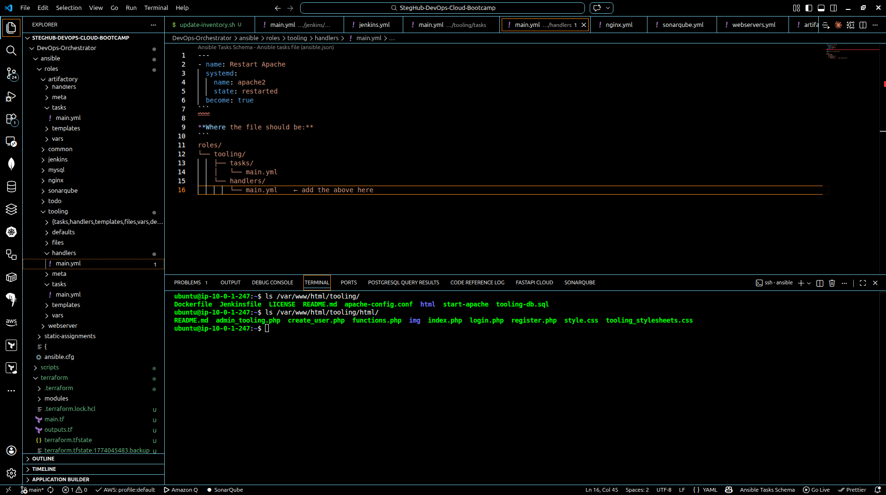
> VSCode showing full Ansible roles directory — artifactory, common, jenkins,
> mysql, nginx, sonarqube, todo, tooling, webserver. Terminal showing
> tooling server contents: Dockerfile, html/, tooling-db.sql etc.
> Confirms DocumentRoot must be /var/www/html/tooling/html/
